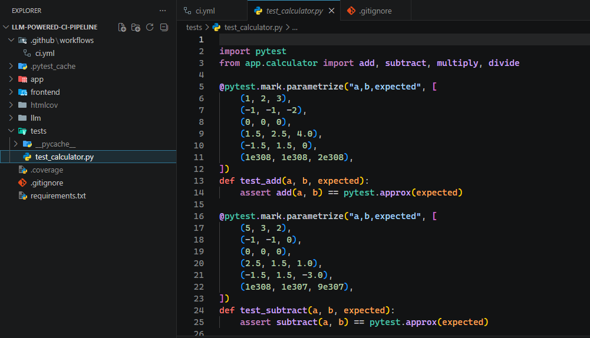
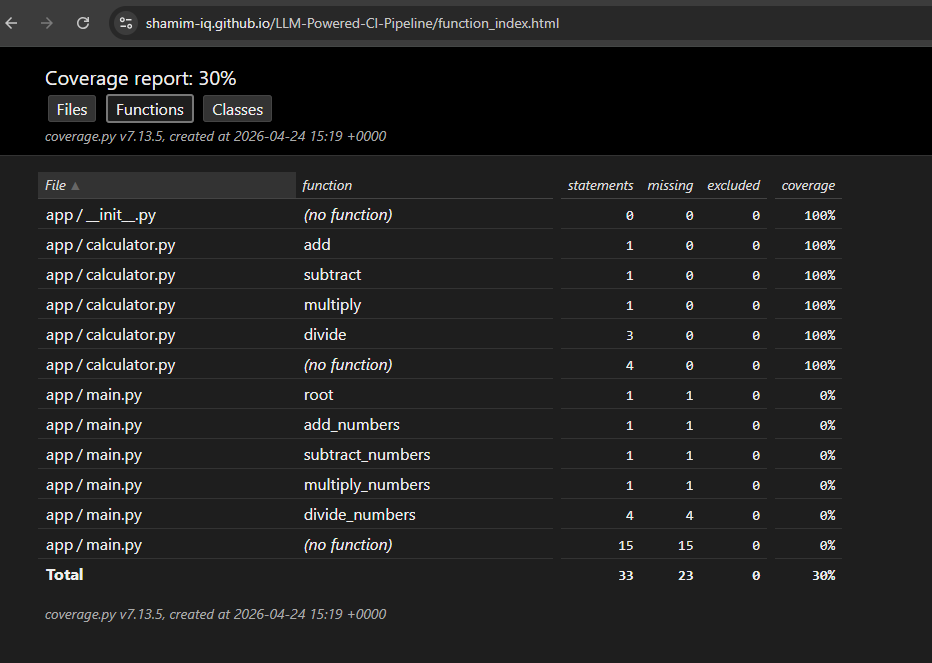

# LLM-Powered CI/CD Pipeline with Code Coverage


## Project Summary

This project demonstrates a DevOps and Generative AI integrated CI/CD pipeline using GitHub Actions.

It includes:

- A Python-based calculator application with backend and frontend components
- Automated test case generation using an LLM through the OpenAI API
- Code coverage measurement using `pytest-cov`
- HTML coverage report deployment through GitHub Pages

The goal is to simulate a real-world AI-assisted CI/CD pipeline.

## Objective

- Build a full-stack Python calculator application
- Integrate an LLM to dynamically generate test cases
- Automate test generation, test execution, and code coverage reporting
- Deploy coverage reports for browser access using GitHub Pages

## Tech Stack

- Python
- FastAPI
- Pytest and `pytest-cov`
- GitHub Actions
- OpenAI API
- HTML, CSS, and JavaScript

## Steps to Run the Lab

### 1. Clone the Repository

```bash
git clone https://github.com/<your-username>/LLM-Powered-CI-Pipeline.git
cd LLM-Powered-CI-Pipeline
```

### 2. Install Dependencies

```bash
pip install -r requirements.txt
```

### 3. Set the OpenAI API Key

Linux/macOS:

```bash
export OPENAI_API_KEY="your_api_key"
```

Windows PowerShell:

```powershell
$env:OPENAI_API_KEY = "your_api_key"
```

### 4. Run the Backend

```bash
uvicorn app.main:app --reload
```

### 5. Run LLM Test Generation

```bash
python llm/generate_tests.py
```

### 6. Run Tests with Coverage

```bash
pytest --cov=app --cov-report=html
```

### 7. View the Local Coverage Report

Open the generated report in your browser:

```text
htmlcov/index.html
```

### 8. CI/CD Execution

- Push code to GitHub.
- GitHub Actions triggers the pipeline automatically.
- The generated coverage report is deployed through GitHub Pages.

## LLM Integration: `generate_tests.py`

### Purpose

This script integrates Generative AI into the CI/CD workflow by:

- Reading the application source code from `app/calculator.py`
- Sending the source code to the OpenAI API
- Generating pytest test cases dynamically
- Writing the generated tests to `tests/test_calculator.py`

### Key Functionalities

#### 1. Code Extraction

Reads the calculator application logic:

```python
read_code()
```

#### 2. Prompt Engineering

Guides the LLM to generate tests with:

- Correct imports
- Edge case handling
- Executable pytest output

#### 3. LLM API Call

Calls the OpenAI API:

```python
client.chat.completions.create()
```

Generates:

- Unit tests
- Edge case tests
- Exception handling tests

#### 4. Sanitization Layer

Fixes common LLM output issues, including:

- Incorrect imports, such as replacing `your_module` with `app.calculator`
- Markdown artifacts
- Formatting issues

#### 5. Fallback Mechanism

If LLM generation fails, the script:

- Uses predefined static test cases
- Prevents the pipeline from failing because of test generation errors

### Generated Test Cases Snapshot



## Coverage Report

### GitHub Pages Live Report

```text
https://<your-username>.github.io/LLM-Powered-CI-Pipeline/
```

### Coverage Report Snapshot


